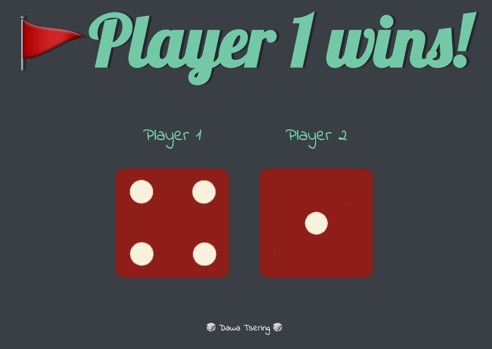
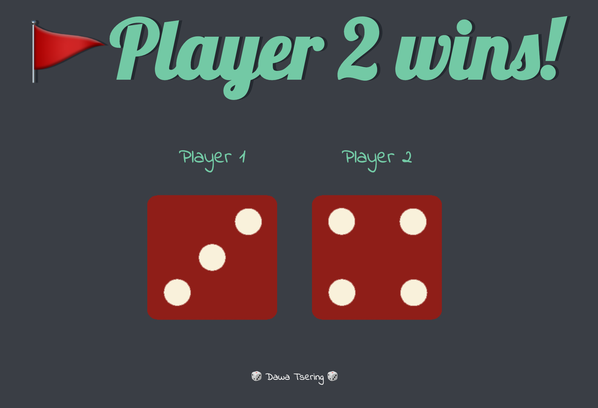
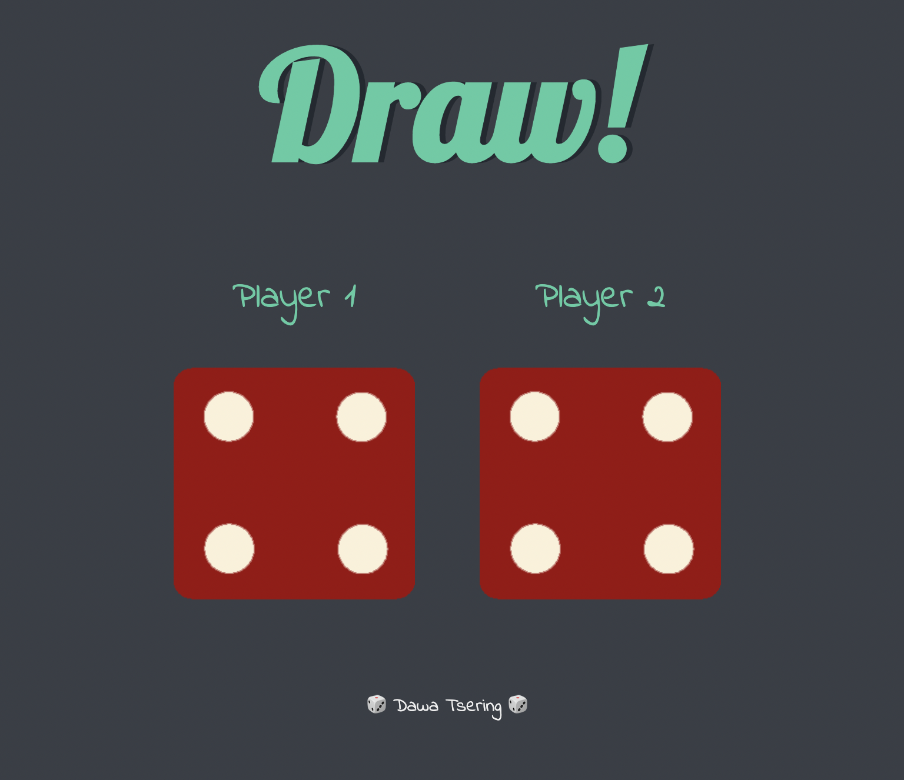

# Dice-Game
This is the 1st Boss Level Challenge Project for The Complete Web Development Bootcamp Course by Angela Yu.
The website simulates a dice game challenge where on every refresh both dice are thrown and a random dice face is generated for both players. The player with larger Dice wins!

## Deployment

Deployed Website: https://daway101.github.io/Dicee/

## Snapshots:
### Player 1 Wins-

### Player 2 Wins-

### Draw Condition-

## Built With

  * HTML
  * CSS
  * Javascript

## Authors

- LinkedIn - [Dawa Tsering](https://www.linkedin.com/in/dawatsering/)

## Acknowledgments

  * The Complete 2022 Web Development Bootcamp by Angela Yu
